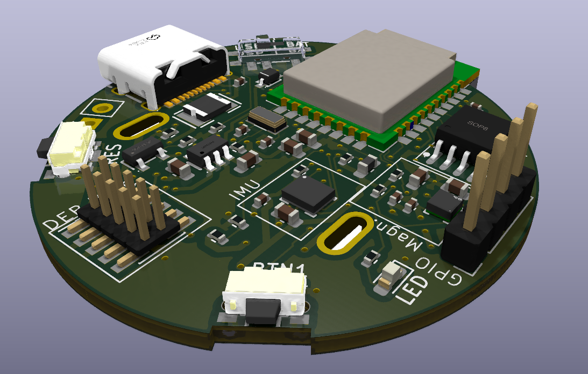

# PCBA IMU Tag

A compact IMU tag PCB designed in KiCad.

## Preview

## Project files

- `*.kicad_pro` — KiCad project file
- `*.kicad_sch` — schematic
- `*.kicad_pcb` — PCB layout

## Status

Work in progress.